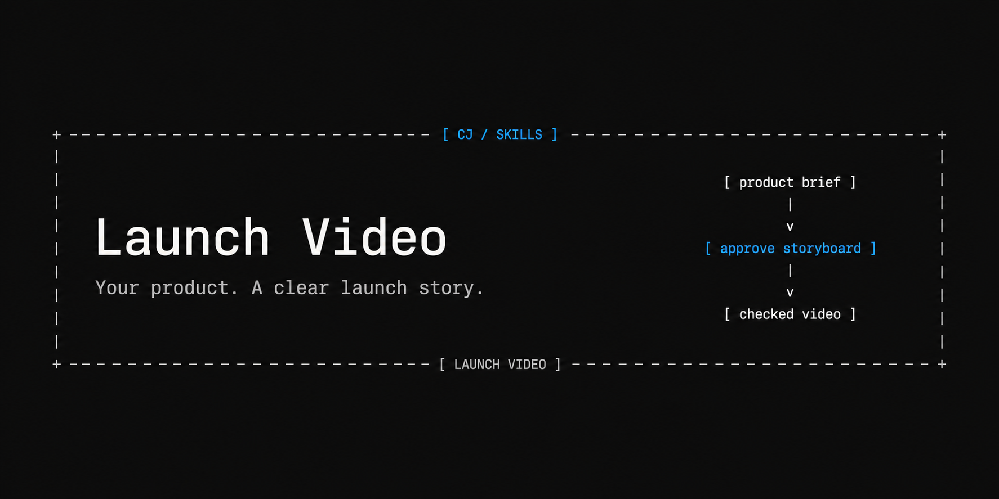
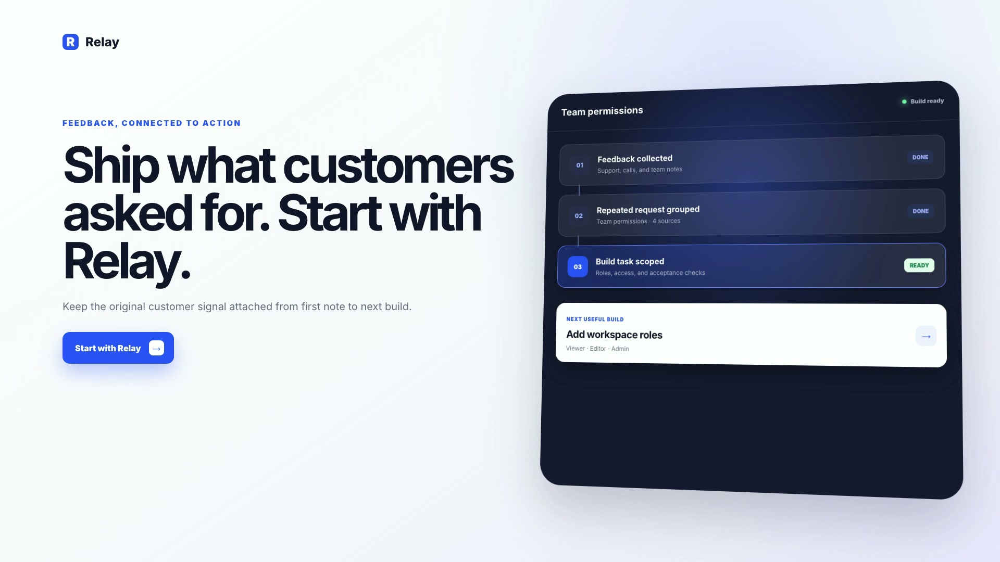

# Launch Video



Turn a product brief into a launch video with Codex and HeyGen HyperFrames.

- Reads your product and brand.
- Writes a short, clear script.
- Designs every scene in an HTML storyboard.
- Waits for your approval.
- Animates the approved story.
- Checks the video and gives you an MP4.

## Demo

[](https://github.com/Cjbuilds/launch-video/releases/download/v0.1.0/relay-v1.mp4)

[Watch or download the video](https://github.com/Cjbuilds/launch-video/releases/download/v0.1.0/relay-v1.mp4) · [Download the storyboard](https://github.com/Cjbuilds/launch-video/releases/download/v0.1.0/storyboard.html) · [QA results](QA.md)

Relay is a fictional product. Its original screens show scattered feedback becoming a grouped request and a scoped build task. Five scenes. 30 seconds. 1920×1080 at 30 fps. Silent. The storyboard was approved before animation began.

## Install

Copy `skills/launch-video` into your project's `.agents/skills/` directory, or into `~/.codex/skills/` for personal use. Preserve an existing installation before replacing it. Start a new Codex task if the skill does not appear.

Rendering needs Node 22+, Python 3.9+, Git, FFmpeg, and ffprobe. The workflow uses pinned `hyperframes@0.8.37`; the first render may download headless Chrome and fonts. Read the [setup and verified source pin](skills/launch-video/references/upstream.md). Basic local rendering needs no paid media account. Optional voice/music providers are separate.

## Use

```text
Use $launch-video for this product: <URL or brief>.
Audience: <who it helps>.
Goal: <what viewers should understand or do>.
Show me the designed storyboard before making the full video.
```

The agent opens a storyboard with designed frames, exact copy, timing, and motion notes. Approve it or name the scenes to change. Material changes require renewed approval. Routine animation repairs can proceed.

## Reproduce the demo

From the repository root:

```sh
python3 skills/launch-video/scripts/launch_video.py storyboard examples/relay
```

Open `examples/relay/storyboard.html`. Review the frames, then record **your actual approval** using its displayed version:

```sh
python3 skills/launch-video/scripts/launch_video.py record-approval examples/relay \
  --version <DISPLAYED_VERSION> --approver <YOUR_NAME> --decision '<YOUR_APPROVAL>'
python3 skills/launch-video/scripts/launch_video.py render examples/relay --output output/relay-v1.mp4
```

The checked-in animation source uses local GSAP 3.14.2. Approval records and generated videos are kept out of Git. After rendering, open `examples/relay/watch.html` to play the result. Existing outputs are preserved; choose a new filename for another render. See the [project format](skills/launch-video/references/project-format.md) for revisions and asset rules.

## Checks and limits

```sh
python3 -m unittest discover -s tests -v
```

16 tests cover approval binding, revisions, sparse input, asset failures, composition drift, engine errors, and export specifications. The actual Relay workflow also passed HyperFrames checks, encoding, full decoding, and browser playback. See [QA.md](QA.md) for scope and failures repaired.

The helper records approval; it does not authenticate a person. Source checks cannot prove complete visual or semantic fidelity. Review the actual video. Audio providers, website capture, and automatic skill discovery were not validated by this silent fictional demo. No one-shot quality or time/token-saving claim is made.

## Credits

Original package code and fictional UI: [MIT](LICENSE). Engine: [HeyGen HyperFrames, Apache-2.0](https://github.com/heygen-com/hyperframes/blob/e30992fdb8c6278db6afde2b5deeb7908835c524/LICENSE). The demo's vendored GSAP keeps its separate [Standard License](examples/relay/assets/vendor/README.md). Third-party showcase code/media are not included. [Visual reference study](skills/launch-video/references/reference-study.md).
